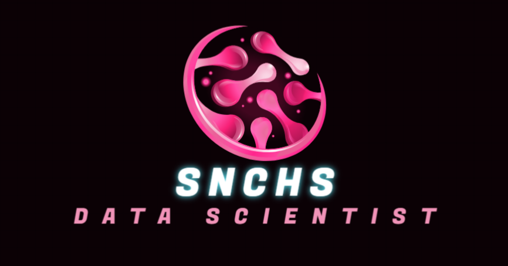

## Привет! 👋
### Меня зовут Snchs и я занимаюсь Data Science. В своей работе я использую широкий спектр инструментов и технологий, включая Python, C#, SQL, MDX, GPSS, а также Blender, Photoshop и Figma.

## Основные направления моей деятельности:

- ### **Data Science и Машинное Обучение:** разработка моделей, анализ данных и построение прогнозов. Знание TensorFlow, 
- ### **Работа с OLAP Кубами:** опыт в проектировании и оптимизации многомерных аналитических приложений.
- ### **Программирование:** Опыт разработки на Python и C# для различных задач в области анализа данных и автоматизации процессов.
- ### **Дизайн:** Увлекаюсь созданием визуального контента, использую Blender для 3D моделирования, Photoshop и Figma для графического дизайна.

### Я стремлюсь постоянно расширять свои знания и навыки, активно изучаю новые технологии и подходы в области Data Science и дизайна.
