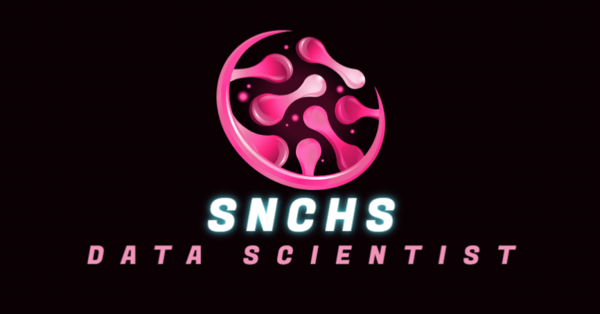

## Привет! 👋
### Меня зовут [Ваше Имя], и я специализируюсь на **Продуктовой Аналитике**. Я помогаю продуктовым командам принимать решения на основе данных, а не интуиции. В своей работе я превращаю сырые логи в actionable-инсайты, используя весь арсенал современных инструментов: от SQL-запросов в ClickHouse до статистических тестов в Python.

## 🛠️ Мой стек технологий

## 📊 Ключевые направления работы

### 🧠 **Продуктовые метрики и юнит-экономика**
- **Воронки и конверсии:** Построение сквозной аналитики от первого касания до целевого действия. Поиск «узких горлышек» в продукте.
- **Когортный анализ:** Оценка Retention Rate, LTV, динамики возвращаемости аудитории. Сегментация пользователей по поведению и источникам трафика.
- **Юнит-экономика:** Расчет CAC, ARPU, ARPPU, Contribution Margin. Понимание, сколько стоит привлечение пользователя и когда он окупается.

### 📈 **A/B-тестирование и статистика**
- **Дизайн экспериментов:** Расчет выборки, оценка MDE (минимально детектируемого эффекта), сплитование трафика без пересечений.
- **Анализ результатов:** Проверка гипотез с помощью t-test (Стьюдента), Манна-Уитни, бутстрепа. Оценка статзначимости не только средних значений, но и квантилей (процентилей).
- **CUPED и стратификация:** Применение методов снижения дисперсии для ускорения A/B-тестов.

### 🔍 **Исследование поведения пользователей**
- **Анализ сессий и потоков:** Визуализация путей пользователя (Sankey diagrams), анализ глубины просмотра и паттернов навигации.
- **Сегментация RFM:** Разделение базы на лояльных, спящих и уходящих клиентов для триггерных рассылок.
- **Поиск аномалий:** Оперативный мониторинг падения конверсий в реальном времени с помощью статистических детекторов (IQR, Z-score).

### 🏗️ **Инфраструктура данных и Self-Service аналитика**
- **ETL и витрины данных:** Написание сложных SQL-запросов, создание материализованных представлений и пайплайнов в Airflow для автоматизации отчетности.
- **Дашборды для команд:** Разработка BI-решений в Tableau / Superset. Мой принцип: «Дашборд должен отвечать на бизнес-вопрос за 5 секунд, а не вызывать желание выгрузить CSV в Excel».
- **Алертинг:** Настройка автоматических уведомлений о критических изменениях метрик в Slack/Telegram.

### 🗣️ **Взаимодействие с командой**
- **Data-informed подход:** Я не просто приношу цифры, я приношу рекомендации. Работаю в плотной связке с **Product Manager** (генерация гипотез) и **Разработкой** (корректное логирование событий).
- **Документирование:** Веду Data Dictionary и логику расчетов в Confluence/Notion, чтобы у всей команды было единое окно правды.

## 📚 Мои постоянные вызовы и интересы
- Как измерить вовлеченность, если у нас не экранное время, а сложный B2B-интерфейс?
- Как строить модели оттока с учетом эффекта сезонности и когорт?
- Как ускорить аналитику, когда в сырых таблицах уже петабайты данных?

### Я постоянно изучаю новые подходы к аналитике и визуализации данных, потому что в мире продуктов это единственный способ оставаться на шаг впереди конкурентов.

